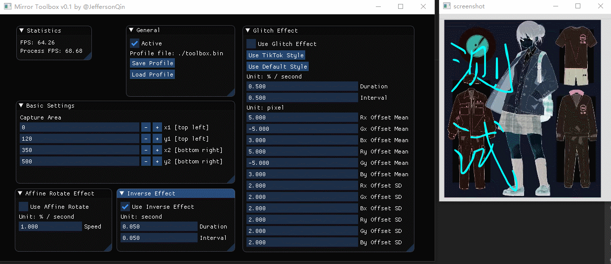
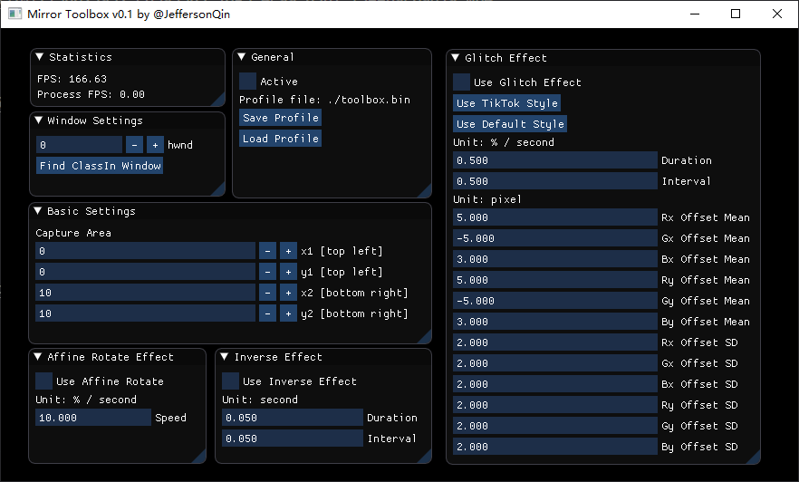

# mirror-toolbox

本工具为 ClassIn 上网课时的镜像工具箱。数据流：


注：对于 ClassIn 之外的软件亦可运行，后文会有描述。

* CLI: 指定 `HWND` 参数
* GUI: 指定 `HWND` 参数，不自动寻找 ClassIn 窗口，或者使用前台窗口捕获器。

## 基本功能

已实现以下功能。

### 仿射旋转


### 反色闪烁



### 故障艺术: RGB 分离 (内置仿抖音特效参数)

默认方案：

https://user-images.githubusercontent.com/30655701/158623852-1e124bce-5990-4ac2-8bb9-3fd14a533796.mp4

抖音方案：

https://user-images.githubusercontent.com/30655701/158623952-c6593583-76a5-4c99-b3b1-13eeb9c69d79.mp4

### 综合使用

https://user-images.githubusercontent.com/30655701/158623903-808892bf-6281-4cfb-8419-45292ab325c6.mp4

## GUI 使用

```
> python gui.py
```



在进入 ClassIn 的教室之后，点击 `Find ClassIn Window`，然后再点击 `Activate` 即可开始运行。

GUI 还编写了保存 / 加载配置的功能。

注意：如果不想要捕获 ClassIn，而是想捕获其他窗口，只需要自己指定窗口的 **十进制** HWND 即可。

Update: 增加了前台窗体捕获功能。开启 `Foreground Window Capture` 后，捕获好窗口后点击 `Use Current HWND` 即可设置。

## CLI 使用

```
> python .\cli.py start --help
Usage: cli.py start [OPTIONS]

  Start toolbox

Options:
  --hwnd TEXT                     hwnd of the window to capture
  --x1 INTEGER                    top left horizontal coordinate of ROI    
  --y1 INTEGER                    top left vertical coordinate of ROI
  --x2 INTEGER                    bottom right horizontal coordinate of ROI
  --y2 INTEGER                    bottom right vertical coordinate of ROI
  --use-affine-rotate BOOLEAN     use affining rotate
  --affine-rotate-speed FLOAT     affine rotate speed (% / second)
  --use-inverse-effect BOOLEAN    use inverse effect
  --inverse-effect-duration FLOAT
                                  inverse effect duration (second)
  --inverse-effect-interval FLOAT
                                  inverse effect interval (second)
  --use-rgb-split-glitch BOOLEAN  use rgb split glitch art effect
  --use-tiktok-style BOOLEAN      use tiktok style rgb split glitch
  --glitch-duration FLOAT         rgb split glitch duration (second)
  --glitch-interval FLOAT         rgb split glitch interval (second)
  --glitch-rx-offset-mean FLOAT   glitch: mean X offset of R channel
  --glitch-gx-offset-mean FLOAT   glitch: mean X offset of G channel
  --glitch-bx-offset-mean FLOAT   glitch: mean X offset of B channel
  --glitch-ry-offset-mean FLOAT   glitch: mean Y offset of R channel
  --glitch-gy-offset-mean FLOAT   glitch: mean Y offset of G channel
  --glitch-by-offset-mean FLOAT   glitch: mean Y offset of B channel
  --glitch-rx-offset-sd FLOAT     glitch: sd of X offset of R channel
  --glitch-gx-offset-sd FLOAT     glitch: sd of X offset of G channel
  --glitch-bx-offset-sd FLOAT     glitch: sd of X offset of B channel
  --glitch-ry-offset-sd FLOAT     glitch: sd of Y offset of R channel
  --glitch-gy-offset-sd FLOAT     glitch: sd of Y offset of G channel
  --glitch-by-offset-sd FLOAT     glitch: sd of Y offset of B channel
  --help                          Show this message and exit.
```

## Dependencies

* [pyimgui](https://github.com/pyimgui/pyimgui)
* opencv-python
* pywin32
